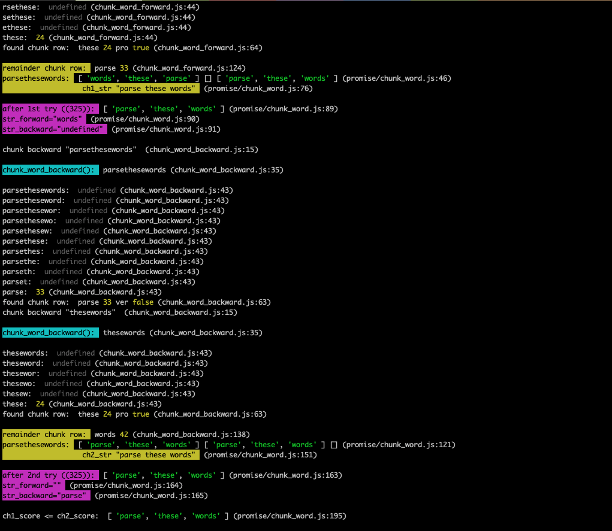

# Add color to your console messages

No dependencies. No setup required. Easily integrate with Cloud logging (LogDNA, etc). Visually group similar types of logs in the terminal. Show a concise file/line trace for each message - so you can actually find where it's originating without looking through the entire codebase.



Works on both Node.js and in Browser. Colors do not work inside IDEs like CodePen.io. Scroll down for browser usage. This is code still experimental and will change until `version 1`. Do **not** install `@latest`, but stick to a well-tested current version.

[](https://www.npmjs.com/package/colorful-console-logger)  


##

# Use in Node.js (CommonJS or ES Modules)

### See example usage in `./examples` folder!

### 1. Import it:
```
const cconsole = require('colorful-console-logger');
```
Name it whatever you want (`konsole`, `consola`, `consolee`)


### 2. Use it:
```
cconsole.time();
cconsole.clear();
cconsole.log('no special colors');
cconsole.info('light blue (teal/aqua) background');
cconsole.warn('this is a warning, yellow/orange background');
cconsole.error('Error: bright red background, yellow text');
cconsole.trace('TEST log trace');
cconsole.error(new Error('TEST log error'));
cconsole.table([[1, 2, 3, 4, 5], ['a', 'b', 'c', 'd', 'e']]);
cconsole.timeEnd();
```

### 3. Advanced usage:

```
const cconsoleInit = require('colorful-console-logger/cconsoleInit');

globals['cconsole'] = cconsoleInit({
  useTrace: true, // show file and line-number where the console was called from
  useColor: true, // add a splash of color, to find the info, warn, or debug more easily
  separateTypes: true, // put a space between groups of similar types (logs, infos, warns)
  logToCloud: {
    log: customCloudLogFunction,
    info: customCloudInfoFunction,
    warn: customCloudWarnFunction,
    error: customCloudErrorFunction
  }
})
// the globals variable is just a suggestion, so you don't have to keep initiating it in every file
```


##

# Use in browser


## Auto-init with default options:

### 1. Import it:
```
<script src="https://raw.githubusercontent.com/paulshorey/colorful-console-logger/main/dist/cconsole.js"></script>
<!-- this script will add window.cconsole variable to your webpage -->
```

### 2. Use it:
```
cconcole.info('this message will have background light blue')
cconcole.warn('this message will have background yellow')
cconcole.error('this message will have background red with yellow text')
```

### 3. Advanced usage:

```
<script src="https://raw.githubusercontent.com/paulshorey/colorful-console-logger/main/dist/cconsoleInit.js"></script>
<!-- this script will add window.cconsoleInit variable to your webpage -->

const cconsole = cconsoleInit({
  useTrace: true, // show file and line-number where the console was called from
  useColor: true, // add a splash of color, to find the info, warn, or debug more easily
  separateTypes: true, // put a space between groups of similar types (logs, infos, warns)
  logToCloud: {
    log: customCloudLogFunction,
    info: customCloudInfoFunction,
    warn: customCloudWarnFunction,
    error: customCloudErrorFunction
  }
})

cconcole.info('this message will have background light blue, and will log to your cloud provider')
```

##

# Development

### Run dev:
`npm install` && `npm run dev`
This will run Parcel with `--watch` flag. Changes from `./src` folder will be written to `./dist`. Experiment in `./examples` folder.

### Test:
`npm run test` No coverage for now. It runs the examples (`./examples/cconsole*.js` files). It's difficult to test console logs. So, this does not test what colors (if any) are printing out, or if all the options are working. Just checks if the code threw an error, or if it ran successfully.

### Build, commit, push:
`git commit` triggers "pre-commit" hook which runs linting and testing, and fails if something fails. If successful, then it will `npm run build` and `git add .`, then `git push`.


##

# About

Made by [Paul Shorey](https://paulshorey.com) for personal projects, for future clients and employers, for everyone. This is a work in progress.
